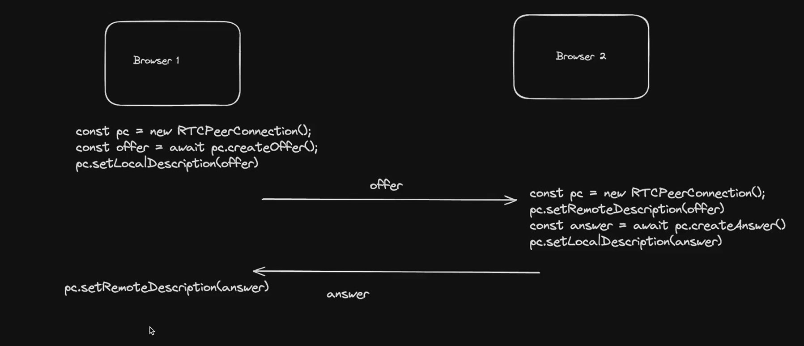

# SO HOW DOES A WEBRTC WORK ? MORE SPECIFICALLY HOW REAL TIME MEDIA COMMUNICATION HAPPENS

two clients or multiple clients exhannge their ips with each other so they can know where to send the video packets
they send the video packets through a p2p comm protocol

now the p2p comm is made as follows >>

first the client 1 sends a request to a STUN server .. saying the STUN server whats's my request coming from is it a public ip or private ip
base on that the stun server responds with ice canditates (they are the ip addresses that can be shared with another client to receive or send media)

the clien2 does the same thing 

so both of the client have their ice candidates and they send it to a signalling server

what the signalling server does is >

the client sends the signaling server their ice candidates and the server sends it to another client , this happens for both of the clients

after this process is done then the stun server and the signalling server can disconnect as the clients got each others ip addresses and the p2p conn is established

so basically kill the stun server and the signalling server

---------------------------------------------------------------------------------------------------------------------------------------------------------------------------

the stun server gives out this ice candidates >>

firstly they try the first one , if it dosent work then it trys the second one which works every time as it is over the internet

# sometimes when another client's media/data would not come to yours 

reason is coz u may have a very restrictive network policy

to solve it we use TURN server

it gives you a bunch of extra candidates

what are these candidates is >>

so basically suppose the client shares each of their ips for two way media comm . if it dosent work they do with the extra candidate that is provided by the turn server

that is basically  -- > the clients share their media to the server and the other client receives media from it 

it is like media is getting turned through a server rather than directly sharing media with each other

so turn server is kind of a fallback when direct media transfer is not possible 

# offer and answer>>

when the ice candidate transfer being done

when one client shares ice candidate to other cliend trough a signaling server . the first one to do that makes an offer and the other client 
makes an answer and sends it to the offering client
and hence the excahinging of the addresses has been done

offer and answer is done for a single webrtc conn like live streaming and their are viewers so the streamer creates an offer and the viewers creates an answer to the offer

for a video call between two person , there has to be two webrtc connections 

the first client will send an offer to anothe client and the other client gets the offert prepares the asnwer and also sends the offer to prev client and prev client also prepares answer
fort the new offer . and this goes on for the media transmission

# SDP (Session Description Protocol)

after getting the ice candidates from the stun server when we send to the signalling server we share SDP which contains the ice candidates and a bunch of other things

SDP contains the ice candidates ,  what media the client is sending  , what protocols they have used to encode the media and decode the media

this SDP is shared when the offer and answer is sent

# RTC Peer connection >>

this lets you create a webrtc connnection

Connecting the two sides
The steps to create a webrtc connection between 2 sides includes - 
 
Browser 1 creates an RTCPeerConnection
Browser 1 creates an offer
Browser 1 sets the local description to the offer
Browser 1 sends the offer to the other side through the signaling server
Browser 2 receives the offer from the signaling server
Browser 2 sets the remote description to the offer
Browser 2 creates an answer
Browser 2 sets the local description to be the answer
Browser 2 sends the answer to the other side through the signaling server
Browser 1 receives the answer and sets the remote description

 
This is just to establish the p2p connection b/w the two parties
 
To actually send media, we have to 
Ask for camera /mic permissions
Get the audio and video streams
Call addTrack on the pc
This would trigger a onTrack callback on the other side

# a good convertion about SFU >>

what does sfu do ?
ChatGPT said:
ChatGPT
SFU typically refers to a Selective Forwarding Unit, which is a key component in real-time communication systems, especially in WebRTC (Web Real-Time Communication) applications. Here's what it does:

SFU in WebRTC Context
An SFU is a type of media server that selectively forwards media streams from one participant to others in a multiparty communication system.
It acts as a middleman between peers in a video/audio call or conference, optimizing the process of media transmission.
Key Features and Functions
Selective Forwarding:

Unlike an MCU (Multipoint Control Unit), which mixes media streams into a single stream, an SFU forwards individual streams to participants based on their bandwidth, device capabilities, or user preferences.
Bandwidth Efficiency:

By not mixing streams, SFUs reduce processing overhead and allow participants to receive streams in the best possible quality based on their network conditions.
Scalability:

SFUs are well-suited for large-scale applications, as they don't need to process streams heavily. This makes them cost-effective and scalable for video conferencing apps.
Support for Simulcast and SVC:

SFUs can work with simulcast (sending multiple versions of a video at different resolutions) and SVC (Scalable Video Coding), allowing adaptive streaming based on network conditions.
Low Latency:

Since SFUs avoid the computationally expensive task of mixing streams, they introduce minimal delay, making them ideal for real-time interactions.
Use Cases
Video conferencing platforms (e.g., Zoom, Google Meet, Microsoft Teams).
Interactive live streaming.
Online education and webinars.
Gaming or collaborative tools that require low-latency communication.
Would you like to explore how SFUs are implemented or how they compare to MCUs?

You said:
so how does shit happen in a google meet call of 20 people where everyone is sharing their videos ?
ChatGPT said:
ChatGPT
In a Google Meet call with 20 participants where everyone is sharing their video, a Selective Forwarding Unit (SFU) is at work behind the scenes. Here's how it handles such a scenario efficiently:

How Google Meet Manages Multi-Party Video Calls
Peer-to-SFU Architecture:

Each participant's device (peer) connects to a central SFU in Google's infrastructure.
Instead of sending your video/audio stream directly to all other participants (which would require huge bandwidth), you send it once to the SFU.
Selective Forwarding:

The SFU forwards your stream to the other participants, but it doesn't just blindly pass all streams to everyone. Instead, it selectively forwards streams based on:
Bandwidth Constraints: Ensuring participants with poor internet connections get a lower-resolution stream.
Screen Layout: Only streams for participants visible on your screen (e.g., the active speaker and others in a grid) are sent in higher resolution, while others are downgraded or paused.
Simulcast and Scalable Video Coding (SVC):

Participants’ devices send multiple versions of their video streams at different resolutions (simulcast).
The SFU chooses which version to forward to each participant based on their network conditions, device capabilities, and the screen layout.
Dynamic Stream Management:

If you're viewing the call in tile view (grid layout), the SFU may send lower-resolution versions of all 20 video streams to fit them into smaller tiles.
If you switch to speaker view, only the active speaker's stream is sent in high resolution, while others are paused or sent in low resolution.
Bandwidth Optimization
Google Meet employs several techniques to reduce the bandwidth required:

Adaptive Bitrate Streaming: Video quality adjusts dynamically based on your internet speed.
Audio Prioritization: Audio streams are given priority over video, ensuring communication remains smooth even if bandwidth drops.
Video Pausing: If your connection becomes too slow, video streams may be paused entirely while audio continues.
Resource Efficiency
On Your Device (Client-Side):

Your device is responsible for encoding and sending a single stream to the SFU.
It also decodes multiple streams from the SFU, but usually at reduced resolutions, depending on the layout.
On the SFU (Server-Side):

The SFU avoids the computationally expensive task of mixing video streams (as an MCU would do).
It efficiently forwards streams to participants, scaling based on their individual needs.
Scaling to 20 Participants
Handling 20 participants requires robust infrastructure:

Cloud Servers: Google Meet uses Google's globally distributed cloud infrastructure to ensure minimal latency and high reliability.
Regional SFUs: Calls are often routed to the SFU nearest to the participants to reduce latency.
Load Balancing: If an SFU becomes overloaded, participants may be rerouted to another server.
Result
Despite 20 participants sharing video, the system remains efficient because:

Your device only sends one stream to the SFU.
The SFU optimizes which streams you receive and in what quality.
Google’s cloud infrastructure ensures smooth communication with minimal latency.
Would you like to dive deeper into any of these aspects, such as simulcast, SVC, or the SFU’s architecture?

You said:

so basically is it like >>>

in a meet of lets say 6 people in gmeet,

there is an SFU and when clients open their cameras then they send the media to the SFU server and the SFU server sends to all the devices that are in the call ?????
ChatGPT said:
ChatGPT
Yes, that's exactly right! Your diagram accurately represents the basic flow of how an SFU works in a Google Meet call (or any similar real-time video conferencing tool). Here's a breakdown of what happens:

Flow in a 6-Person Google Meet Call:
Media Upload:

Each participant's device captures audio and video streams and uploads them to the SFU server.
This reduces the workload on the participant's device since they only need to send their media stream once (to the SFU), not to all the other participants.
Media Distribution:

The SFU receives the streams from all participants.
It forwards these streams to other participants based on their network conditions and screen layouts.
For example, if a participant is pinned (active speaker), their stream may be forwarded in high resolution.
Streams of participants not visible in the layout might not be sent, or only sent in low resolution.
Stream Customization:

The SFU tailors streams for each participant. For instance:
A participant with low bandwidth might receive lower-resolution or fewer video streams.
A participant with a fast connection might receive all streams in full quality.
Client-Side Decoding:

Each participant’s device decodes the streams it receives and displays them in the app.
Why Use an SFU?
Efficiency:
Sending one video stream to the SFU instead of multiple streams (one to each participant) saves significant upload bandwidth.
Scalability:
The SFU handles all media distribution, allowing participants to focus only on sending and receiving their own streams.
Low Latency:
Since the SFU doesn't mix streams, the delay introduced is minimal compared to an MCU (which mixes streams before sending them out).
Your Diagram (Recap):
Arrows to the SFU: Show participants sending their media streams to the server.
Arrows from the SFU: Indicate the SFU distributing streams to all participants in the call.
This is how tools like Google Meet handle multi-party calls efficiently, even with limited bandwidth.

Would you like to explore how simulcast or bandwidth adaptation works in such setups?

You said:
so what happens if the 6 people gets increased to 100 people.. does the SFU scale up to more SFUs with a distributed SFU servers ???
ChatGPT said:
ChatGPT
Yes, exactly! When the number of participants increases, such as from 6 to 100, the SFU scales horizontally to handle the increased load. Here's how this works:

Scaling SFUs for Large Calls
Distributed SFU Architecture:

In large-scale systems like Google Meet, multiple SFUs are deployed across different servers or regions.
Participants are assigned to different SFUs, often based on factors like:
Geographical proximity (to reduce latency).
Server load balancing (to avoid overloading a single SFU).
Inter-SFU Communication:

If the participants in a call are spread across multiple SFUs, these SFUs communicate with each other to share media streams.
For example:
SFU A might handle 50 participants.
SFU B might handle another 50.
SFU A and SFU B exchange the necessary streams so all 100 participants can see and hear each other.
Regional Clusters:

Platforms like Google Meet often use regional SFU clusters in different data centers worldwide.
Participants are connected to the nearest SFU cluster to minimize latency, and these clusters handle communication across regions.
Key Techniques for Scalability
Hierarchical SFUs:

In some systems, a master SFU coordinates multiple child SFUs. The master handles high-level communication, while child SFUs manage subsets of participants.
Dynamic Load Balancing:

Participants are dynamically assigned to different SFUs based on their location, bandwidth, and the SFU's current load.
Bandwidth Optimization:

As the number of participants grows, SFUs optimize media streams further:
Active Speaker Detection: Only the active speaker's video might be sent to all participants in high resolution.
Stream Reduction: Participants not visible in the UI might have their video streams paused or sent at very low resolution.
Cloud Scalability:

Google Meet leverages cloud services (e.g., Google Cloud Platform) to spin up additional SFU instances on demand.
As more participants join, new SFUs are launched to handle the increased load, and traffic is redistributed automatically.
How a 100-Person Google Meet Call Might Work
Client-Side Behavior:

Each participant still sends their media to one SFU (nearest to them or based on load balancing).
They only receive streams for participants visible in their layout (e.g., 9 tiles in a grid).
SFU-Side Behavior:

The SFU forwards media only as needed.
For 100 participants, only the active speaker and selected tiles might be sent to everyone in full resolution.
Streams not visible are paused or sent at minimal quality to save bandwidth.
Advantages of Distributed SFU Systems
Scalability:
Adding more SFUs allows the system to support thousands of participants.
Redundancy:
If one SFU fails, participants can be reassigned to another SFU.
Low Latency:
Regional SFUs reduce latency by keeping participants connected to the closest server.
Would you like to explore more about hierarchical SFUs, load balancing algorithms, or how active speaker detection works?

----------------------------------------------------------------------------------------------------------------------------------

i have a doubt ...

it is . isnt that an appln has a SFU , and whenever there is a gmeet then the SFU is invloved ..

and whenver another meet of different people happens .. isnt that the other meet videos will also come towards us.

what happens ??? are there SFUS for different rooms kind of thing ?

what?
ChatGPT said:
ChatGPT
You're absolutely correct to think of SFUs as being involved in every Google Meet call, but your doubt about how the SFU manages different calls is valid and a common question. Let me break it down for you.

How SFUs Handle Multiple Meetings (Rooms)
Each Meeting is Isolated:

In Google Meet (or any SFU-based system), every "meeting" is a logically isolated session. This means:
The SFU creates separate contexts for each room or meeting.
Media streams from one meeting (room) are kept completely separate from streams of another meeting.
SFU Rooms/Contexts:

Think of the SFU as having a separate "room" for each meeting.
When you join a meeting, your media streams are sent only to the specific room/context of that meeting within the SFU.
The SFU forwards streams only to participants in the same room.
How Isolation Works:

When a new meeting starts, the SFU creates a unique identifier for that meeting (e.g., a meeting ID).
All participants joining that meeting connect to the SFU with the meeting ID.
The SFU keeps track of which streams belong to which meeting and ensures that:
Streams are routed only to participants in the same meeting.
Participants in Meeting A can never see/hear streams from Meeting B.
Multiple SFUs for Scalability:

In large systems, there may be multiple SFUs. For example:
One SFU might handle Meeting A.
Another SFU might handle Meeting B.
Even in this case, the SFUs don't cross-share streams between unrelated meetings.
What Happens When You Start or Join a Google Meet?
Starting a Meeting:

When you start a new Google Meet, a new "room" is created in the SFU system.
The meeting's unique ID is tied to that room, and the SFU starts managing streams for that room.
Joining a Meeting:

When you join a meeting, your client application sends your meeting ID to the SFU.
The SFU ensures your streams are routed only to participants with the same meeting ID.
Why You Don’t See Streams from Other Meetings?
Strict Isolation:

The SFU is designed to route streams based on the meeting context.
Streams from other meetings simply don’t exist in the context of your meeting, so your client won't receive them.
Security:

Isolation is essential for privacy and security.
Without proper isolation, streams from unrelated meetings could leak, which would be a massive security risk.
How Does the SFU Scale for Many Meetings?
Single SFU with Multiple Rooms:

A single SFU can manage hundreds or thousands of rooms by maintaining separate routing tables for each room.
Each room is essentially a lightweight "context" in the SFU.
Distributed SFUs:

For large-scale applications, multiple SFUs are deployed.
Meetings are assigned to different SFUs based on factors like geographic proximity, load balancing, or user location.
Inter-SFU Isolation:

Even if two meetings are handled by the same SFU or different SFUs, they are completely isolated through:
Meeting-specific IDs.
Separate participant lists and routing rules.
Analogy to Help Understand
Imagine an SFU is like a hotel:

Each meeting is like a room in the hotel.
When participants check in (join the meeting), they are assigned to a specific room.
The hotel's staff (SFU) ensures that:
Everything happening in Room 101 stays in Room 101.
Guests in Room 101 cannot hear or see what's happening in Room 102.
Staff don’t mix up services (media streams) between rooms.
Conclusion
SFUs handle multiple meetings by isolating them into rooms or contexts.
Streams from unrelated meetings never cross paths because of strict routing rules enforced by the SFU.
For scalability, multiple SFUs may work together, but they maintain the same isolation principles.
Would you like more details on how the SFU maintains isolation at the protocol level (e.g., via WebRTC signaling)?

