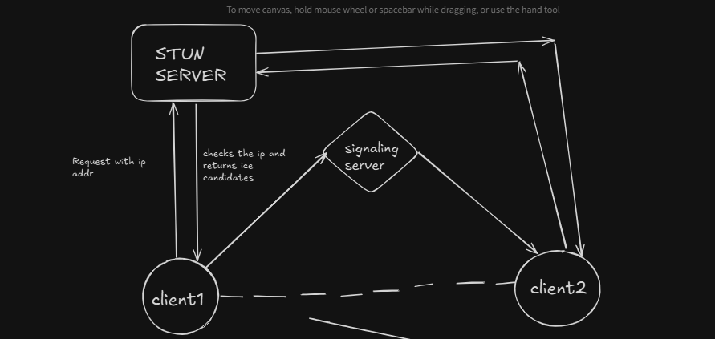

# SO HOW DOES A WEBRTC WORK ? MORE SPECIFICALLY HOW REAL TIME MEDIA COMMUNICATION HAPPENS

two clients or multiple clients exhannge their ips with each other so they can know where to send the video packets
they send the video packets through a p2p comm protocol

now the p2p comm is made as follows >>

first the client 1 sends a request to a STUN server .. saying the STUN server whats's my request coming from is it a public ip or private ip
base on that the stun server responds with ice canditates (they are the ip addresses that can be shared with another client to receive or send media)

the clien2 does the same thing 

so both of the client have their ice candidates and they send it to a signalling server

what the signalling server does is >

the client sends the signaling server their ice candidates and the server sends it to another client , this happens for both of the clients

after this process is done then the stun server and the signalling server can disconnect as the clients got each others ip addresses and the p2p conn is established

so basically kill the stun server and the signalling server

---------------------------------------------------------------------------------------------------------------------------------------------------------------------------

the stun server gives out this ice candidates >>

firstly they try the first one , if it dosent work then it trys the second one which works every time as it is over the internet

# sometimes when another client's media/data would not come to yours 

reason is coz u may have a very restrictive network policy

to solve it we use TURN server

it gives you a bunch of extra candidates

what are these candidates is >>

so basically suppose the client shares each of their ips for two way media comm . if it dosent work they do with the extra candidate that is provided by the turn server

that is basically  -- > the clients share their media to the server and the other client receives media from it 

it is like media is getting turned through a server rather than directly sharing media with each other

so turn server is kind of a fallback when direct media transfer is not possible 

# offer and answer>>

when the ice candidate transfer being done

when one client shares ice candidate to other cliend trough a signaling server . the first one to do that makes an offer and the other client 
makes an answer and sends it to the offering client
and hence the excahinging of the addresses has been done

offer and answer is done for a single webrtc conn like live streaming and their are viewers so the streamer creates an offer and the viewers creates an answer to the offer

for a video call between two person , there has to be two webrtc connections 

the first client will send an offer to anothe client and the other client gets the offert prepares the asnwer and also sends the offer to prev client and prev client also prepares answer
fort the new offer . and this goes on for the media transmission

# SDP (Session Description Protocol)

after getting the ice candidates from the stun server when we send to the signalling server we share SDP which contains the ice candidates and a bunch of other things

SDP contains the ice candidates ,  what media the client is sending  , what protocols they have used to encode the media and decode the media

this SDP is shared when the offer and answer is sent

# RTC Peer connection >>

this lets you create a webrtc connnection